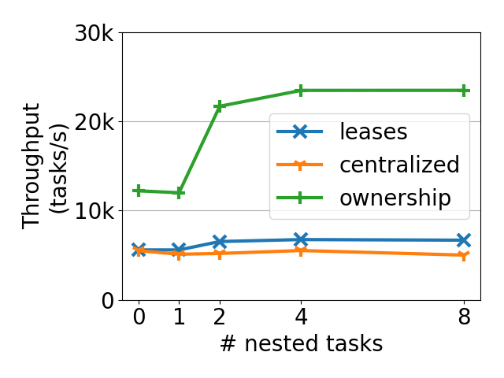

1. (10 min) From this directory, run the benchmark.
```
$ bash run_borrow_microbenchmark.sh
```
The output will be saved in a file structured with `output-<date>.csv`. There is an example in this directory with the name `borrow-Wed 24 Feb 2021 10:47:38 PM PST.csv`.

2. (1 min) Plot the results. For example:
```
python plot.py
```
These use the committed results as the input. Replace the results by passing in the `--filename=<output CSV>` parameter.
You should see results that look something like the following:



The plotting script will also print out the raw values (throughput) that are plotted.
