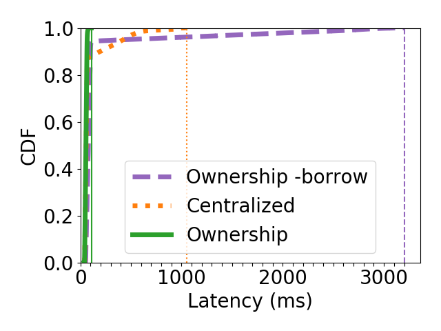

The full benchmark requires GPUs to improve request throughput through batching.
This can be very expensive (4 p3.16xlarge on AWS EC2 is about $50/hr).
This directory includes the full script, as well as a version that does not require GPUs and instead simulates the model requests with a sleep.
The timing is slightly different between the two versions since the simulated version does not do the actual computation.

1. (30 min)  From this directory, run the benchmark.
```
$ bash run.sh
```
The output will be saved in three files, one for centralized, one for ownership, and one for ownership without borrowing. These will be saved as files with with the structure `<system>-output-<date>.csv`. For example, this directory has three files for the GPU version of the benchmark:
```
centralized-output-Sat 27 Feb 2021 01:12:20 PM PST.csv
no-borrow-output-Sat 27 Feb 2021 01:12:20 PM PST.csv
ownership-output-Sat 27 Feb 2021 01:12:20 PM PST.csv
```

To run the simulated version of the benchmark:
```
$ bash run-simulated.sh
```
This will produce files such as the included:
```
centralized-output-simulated-Sat 27 Feb 2021 02:42:23 PM PST.csv
no-borrow-output-simulated-Sat 27 Feb 2021 02:42:23 PM PST.csv
ownership-output-simulated-Sat 27 Feb 2021 02:42:23 PM PST.csv
```

2. (1 min) Plot the results. For example:

```
python plot.py
```

You should see results that look something like the following:



These use the committed GPU results as the input. Change the input files by
passing in the `--filename-suffix=<output CSV>` parameter. For example, see the
simulated results by running the following:
```
python plot.py --filename-suffix='output-simulated-Sat 27 Feb 2021 02:42:23 PM PST.csv'
```

You can also zoom in on a specific percentile with the following:
```
python plot.py --zoom 95
```
