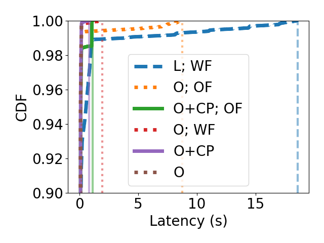

1. (60 min)  From this directory, run the full benchmark.
```
$ bash run-benchmark.sh <number of concurrent videos>
```
The output will be saved in a zip file labeled with the current time and the number of nodes requested.
The zip file includes 8 CSV files, one for each benchmark configuration.
For example, the included `output-60-nodes-Sun 28 Feb 2021 08:58:25 PM PST.zip` contains:
```
centralized-60.csv
leases-60-failure.csv
leases-60.csv
ownership-60-checkpoint.csv
ownership-60-failure.csv
ownership-60-owner-failure-checkpoint.csv
ownership-60-owner-failure.csv
ownership-60.csv
```

To run an individual benchmark, use the following script:
```
$ ./run.sh <centralized|leases|ownership> <number of concurrent videos> <output filename> <extra args for video_processing.py>
```

For example, to run ownership benchmark on one node, with a worker failure:
```
$ ./run.sh ownership 1 output.csv '--failure'
```

2. (1 min) Plot the results. The plotting script expects CSVs with the above format in the current directory, so you must first unzip the results created from the benchmark. For example:

```
unzip output-60-nodes-Sun 28 Feb 2021 08:58:25 PM PST.zip
python plot.py --num-nodes 60
```

You should see results that look something like the following:


You can also plot the failure results. Here is an example, zoomed in on the 90th percentile:

```
python plot.py --num-nodes 60 --failure --zoom 90
```


Here, the legend is:

- L; WF=Leases; Worker failure
- O; OF=Ownership; Owner failure
- O+CP; OF=Ownership+checkpoint; Owner failure
- O; WF=Ownership; Worker failure
- O+CP=Ownership+checkpoint
- O=Ownership
